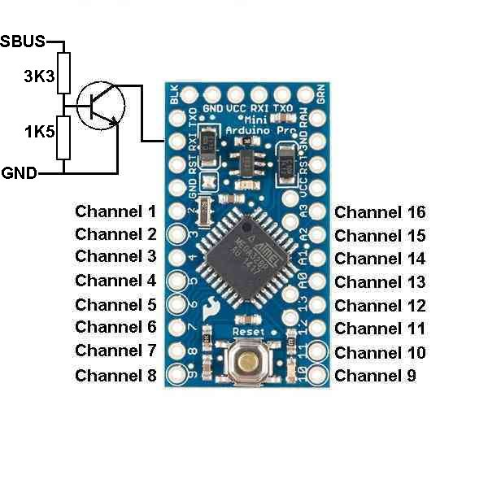

Arduino used as SBUS to 16-channels PPM decoder

Analog input A4 is used to set the failsafe times to the current received pulses.
Connect a switch to this and connect to ground to set the failsafe.
Failsafe is entered if no SBUS signal is being received.

Analog input A5 is an option, if grounded, the outputs for channels 1-8 and 9-16
are swapped.

The Tx pin is another option link. If left open, all works as 16 channels.
If the Tx pin is connected to ground, via a 1K resistor, then it switches 
to 8 channel only mode, but with a servo update rate of 9mS.

Connections:

## License and Disclaimer
This software is provided under the GNU v2.0 License. All relevant restrictions apply including the following. In case there is a conflict, the GNU v2.0 License is overriding.
This software is provided as-is in the hope that it will be useful, but WITHOUT ANY WARRANTY; without even the implied warranty of MERCHANTABILITY or FITNESS FOR A PARTICULAR PURPOSE. See the GNU General Public License for more details. In no event will the authors and/or contributors be held liable for any damages arising from the use of this software.

Permission is granted to anyone to use this software for any purpose, including commercial applications, and to alter it and redistribute it freely, subject to the following restrictions:

1. The origin of this software must not be misrepresented; you must not claim that you wrote the original software.
2. If you use this software in a product, an acknowledgment in the product documentation would be appreciated but is not required.
3. Altered versions must be plainly marked as such, and must not be misrepresented as being the original software.
4. This notice may not be removed or altered from any distribution.  

By downloading this software you are agreeing to the terms specified in this page and the spirit of thereof.
